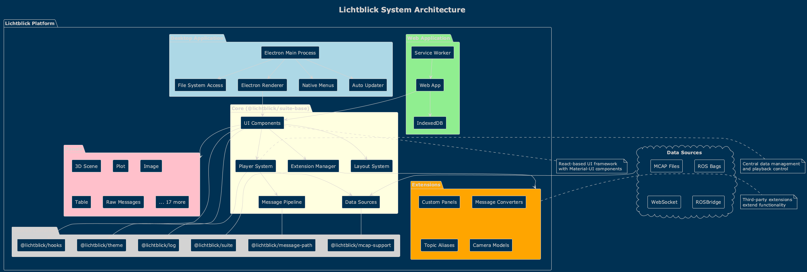
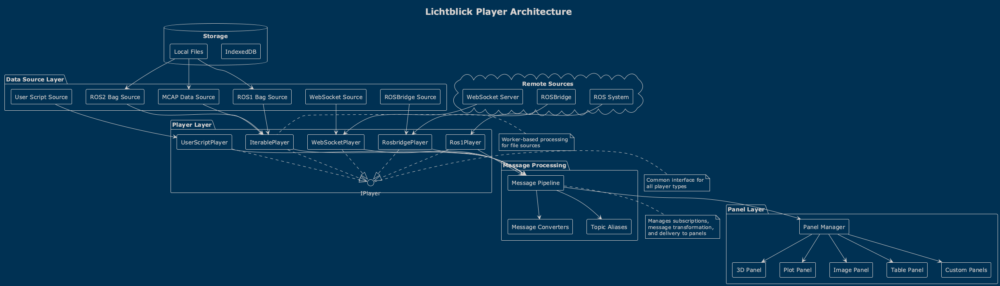
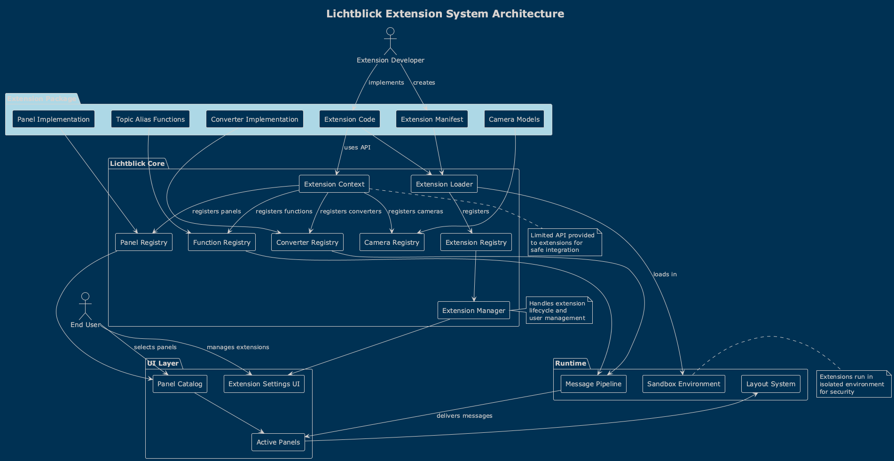
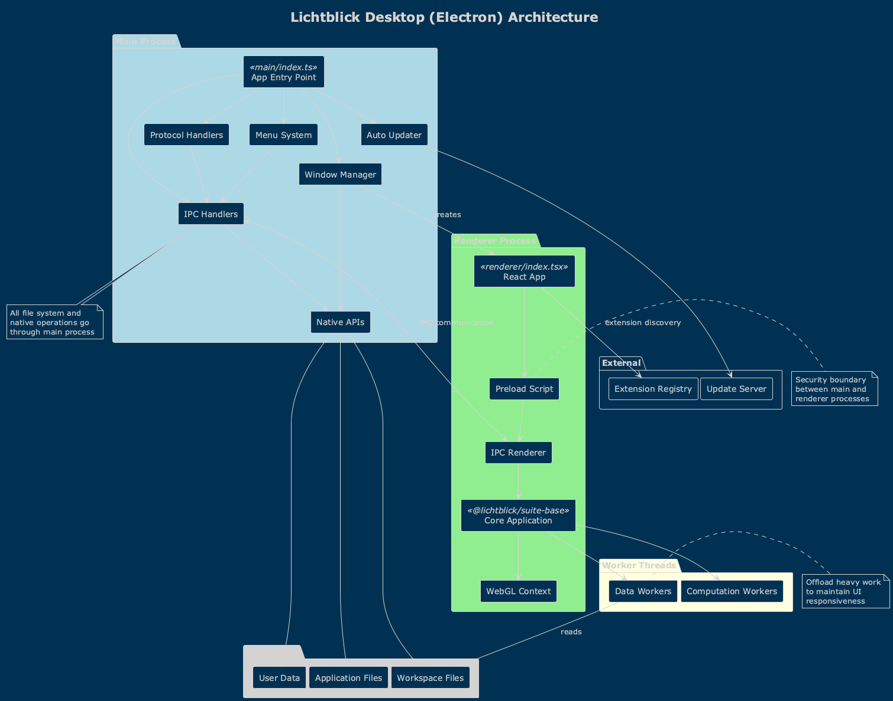
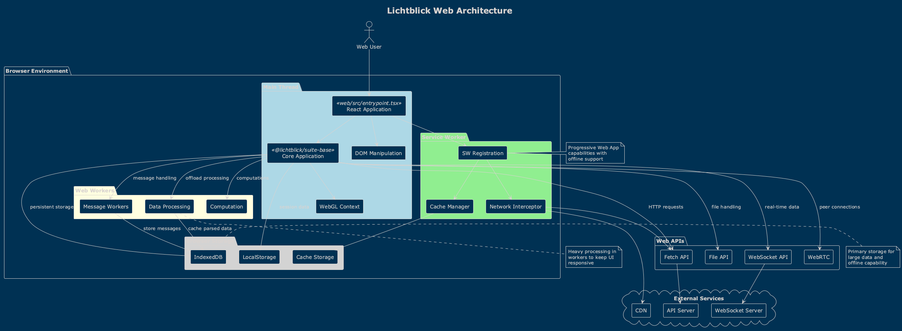

# Lichtblick Architecture Overview

Lichtblick is a powerful, extensible robotics data visualization and analysis platform that supports multiple data sources and formats. This document provides a comprehensive overview of the system architecture.

## Table of Contents

1. [System Architecture](#system-architecture)
2. [Core Components](#core-components)
3. [Technology Stack](#technology-stack)
4. [Data Flow Architecture](#data-flow-architecture)
5. [Extension System](#extension-system)
6. [Platform Architecture](#platform-architecture)

## System Architecture

Lichtblick follows a multi-platform architecture with clear separation of concerns:



The system is built as a monorepo using Yarn workspaces, enabling code sharing while maintaining platform independence. The architecture consists of:

- **Core Business Logic** (`@lichtblick/suite-base`): Platform-agnostic application logic
- **Platform Implementations**: Desktop (Electron) and Web versions
- **Shared Libraries**: Reusable utilities and components
- **Extension System**: Plugin architecture for customization

## Core Components

### Package Structure

The project is organized into several key packages:

#### @lichtblick/suite (v1.14.3)
The public API package providing:
- Extension system interfaces
- Panel extension context
- Message converter system
- Settings tree architecture
- Camera model registration

#### @lichtblick/suite-base
The core application logic including:
- UI components (panels, dialogs, settings)
- Data source factories
- Player architecture
- Extension management
- Layout system
- Theme and internationalization

#### Platform-Specific Packages

**Desktop Package**
- Electron-based desktop application
- Native menu integration
- File system access
- Auto-updater functionality
- Protocol handlers

**Web Package**
- Browser-based application
- Service worker support
- Progressive web app capabilities
- Browser compatibility layer

#### Supporting Packages

- **@lichtblick/log**: Centralized logging infrastructure
- **@lichtblick/hooks**: Shared React hooks library
- **@lichtblick/theme**: Design system and theming
- **@lichtblick/mcap-support**: MCAP file format support
- **@lichtblick/message-path**: Message path parsing and evaluation
- **@lichtblick/den**: Data encoding/decoding utilities

## Technology Stack

### Frontend Technologies
- **Framework**: React 18.3.1 with TypeScript 5.3.3
- **UI Components**: Material-UI (@mui/material 5.13.5)
- **State Management**: Zustand, React Context API
- **Styling**: Emotion (@emotion/react), CSS-in-JS
- **3D Rendering**: Three.js for 3D visualization
- **Data Visualization**: Chart.js for plotting, Monaco Editor for code editing
- **Internationalization**: i18next for multi-language support

### Build and Development Tools
- **Build System**: Webpack 5.99.7
- **Transpilation**: Babel 7.27.1
- **Testing**: Jest 29.7.0, Playwright 1.49.1
- **Linting**: ESLint with custom configurations
- **Package Management**: Yarn workspaces

### Desktop Technologies
- **Runtime**: Electron 36.0.1
- **IPC**: Electron IPC for main/renderer communication
- **Native APIs**: File system, menu bar, protocol handlers

## Data Flow Architecture

### Player System



The Player pattern is central to Lichtblick's data handling:

1. **Data Sources** produce messages in various formats
2. **Players** manage subscriptions and message delivery
3. **Panels** receive messages through render state updates
4. **Message Converters** transform between schemas when needed

### Supported Data Sources

- **File-Based Sources**:
  - MCAP files (`.mcap`)
  - ROS1 bag files (`.bag`)
  - ROS2 bag files (`.db3`)
  - Custom formats via extensions

- **Real-Time Sources**:
  - Foxglove WebSocket connections
  - ROSBridge connections
  - ROS1/ROS2 native connections
  - Velodyne LIDAR streams

### Message Flow

```
Data Source → Player → Message Pipeline → Panels
                ↓
        Message Converters
                ↓
        Transformed Messages
```

## Extension System



The extension system allows third-party developers to extend Lichtblick's functionality:

### Extension Capabilities

Extensions can contribute:
- **Custom Panels**: New visualization types
- **Message Converters**: Transform between message schemas
- **Topic Alias Functions**: Create computed topics
- **Camera Models**: Custom camera projection models
- **Panel Settings**: Additional configuration options

### Extension Loading Process

1. Extension loader discovers installed extensions
2. Extensions are registered in the extension catalog
3. Extension context is provided to each extension
4. Extensions register their contributions
5. UI updates to reflect new capabilities

### Extension API

```typescript
interface ExtensionContext {
  registerPanel(panelExtension: PanelExtension): void;
  registerMessageConverter(converter: MessageConverter): void;
  registerTopicAliasFunction(fn: TopicAliasFunction): void;
  registerCameraModel(model: CameraModel): void;
}
```

## Platform Architecture

### Desktop Architecture



The desktop version uses Electron to provide:

- **Main Process**: 
  - Application lifecycle management
  - Native menu creation
  - File system operations
  - Window management
  - Auto-update handling

- **Renderer Process**:
  - React application
  - WebGL for 3D rendering
  - Worker threads for data processing

- **Preload Scripts**:
  - Secure bridge between main and renderer
  - Expose limited APIs to renderer

### Web Architecture



The web version runs entirely in the browser:

- **Service Worker**: 
  - Offline capability
  - Asset caching
  - Background sync

- **Web Workers**:
  - Data processing
  - File parsing
  - Message transformation

- **IndexedDB**:
  - Local storage
  - Extension data
  - User preferences

### Key Differences

| Feature | Desktop | Web |
|---------|---------|-----|
| File Access | Native file system | File API / Drag & drop |
| Performance | Direct memory access | Browser limitations |
| Updates | Auto-updater | Service worker updates |
| Extensions | Local installation | Web-based delivery |
| Menu | Native menu bar | Web UI menu |

## Panel System

Lichtblick includes 22+ built-in panels for various visualization needs:

### Visualization Panels
- **3D Scene**: Full 3D visualization with markers, meshes, and point clouds
- **Image**: Camera image display with annotations
- **Plot**: Time-series data plotting
- **Map**: Geographic data visualization

### Data Panels
- **Raw Messages**: Message inspection
- **Table**: Tabular data display
- **Log**: Console log viewing
- **Diagnostics**: ROS diagnostics display

### Control Panels
- **Parameters**: Parameter management
- **Publish**: Message publishing
- **Call Service**: Service invocation
- **Variable Slider**: Interactive variables

### Development Panels
- **User Script Editor**: Custom data processing
- **Node Playground**: Visual programming

## Build and Deployment

### Development Workflow

1. **Local Development**: `yarn dev` starts development servers
2. **Testing**: Comprehensive test suite with Jest and Playwright
3. **Building**: Webpack builds for both platforms
4. **Packaging**: Electron Builder for desktop, standard web build

### CI/CD Pipeline

- GitHub Actions for continuous integration
- Automated testing on multiple platforms
- Release builds for stable and nightly versions
- Auto-update infrastructure for desktop

## Performance Considerations

- **Lazy Loading**: Panels and extensions load on demand
- **Worker Threads**: Heavy computation offloaded to workers
- **Virtual Scrolling**: Efficient rendering of large datasets
- **WebGL Optimization**: Instanced rendering for 3D scenes
- **Message Throttling**: Configurable update rates

## Security

- **Extension Sandboxing**: Limited API access for extensions
- **Content Security Policy**: Strict CSP for web version
- **Electron Security**: Context isolation, node integration disabled
- **HTTPS Only**: Secure connections for web services

---

For more detailed information, see:
- [Class Diagrams](class-diagrams.md)
- [Sequence Diagrams](sequence-diagrams.md)
- [Use Cases](use-cases.md)
- [API Documentation](api-documentation.md)