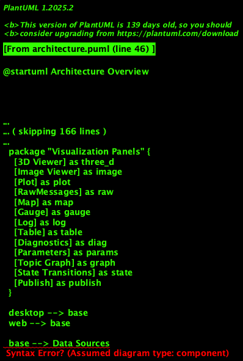
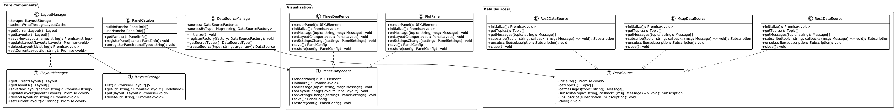

# Lichtblick Architecture

This document provides an overview of the Lichtblick architecture, explaining the main components and their interactions.

## High-Level Architecture

Lichtblick is designed with a modular architecture that separates core functionality from platform-specific implementations. This design allows Lichtblick to run as both a desktop application (using Electron) and a web application.

The architecture consists of the following main components:

1. **Frontend Applications**
   - Desktop App (Electron-based)
   - Web App (Browser-based)

2. **Core Components**
   - `suite-base`: Core functionality shared between desktop and web
   - Layout Manager: Handles the creation, management, and persistence of visualization layouts
   - Extensions System: Allows for extending the application with custom panels and functionality

3. **Data Sources**
   - ROS1 Local Bag
   - ROS2 Local Bag
   - MCAP Files
   - ROS1 Socket Connection
   - Rosbridge WebSocket
   - Foxglove WebSocket
   - ULog Files

4. **Visualization Panels**
   - 3D Viewer
   - Image Viewer
   - Plot
   - Raw Messages
   - Map
   - Gauge
   - Log
   - Table
   - Diagnostics
   - Parameters
   - Topic Graph
   - State Transitions
   - Publish
   - And many more...

## Class Structure

The following diagram shows the main classes and their relationships:

### Key Components

#### Layout Management

The Layout Manager is responsible for managing the user's layouts, which define how panels are arranged and configured in the UI. The core interfaces include:

- `ILayoutManager`: Interface for managing layouts
- `ILayoutStorage`: Interface for persistence of layouts
- `LayoutManager`: Implementation that coordinates between UI and storage

#### Data Source Management

Data sources provide the connection to various robotics data formats and protocols:

- `DataSourceManager`: Manages the registry of available data sources and their factories
- `DataSource` interface: Common interface for all data sources
- Various implementations for different data source types (ROS1, ROS2, MCAP, etc.)

#### Panel System

Panels are the visualization components that display and interact with data:

- `PanelCatalog`: Registry of all available panel types
- `PanelComponent` interface: Common interface for all panel implementations
- Various panel implementations for different visualization needs

## Data Flow

The data flow in Lichtblick follows this general pattern:

1. Data sources connect to external data (files, networks, etc.)
2. Data is normalized into a common message format
3. Panels subscribe to topics from the data source
4. The data source pushes messages to subscribed panels
5. Panels update their visualization based on the received messages

For a detailed view of this process, see the [data loading sequence diagram](./data-loading-sequence.md).

## Extension Points

Lichtblick is designed to be extensible. The main extension points are:

1. **Custom Panels**: Developers can create and register custom visualization panels
2. **Data Source Plugins**: Support for additional data formats can be added
3. **Message Converters**: For handling custom message formats

## Technologies Used

- **TypeScript**: Primary programming language
- **React**: UI framework
- **Electron**: Desktop application framework
- **WebGL/Three.js**: For 3D visualization
- **Chart.js**: For plots and charts
- **ROS Libraries**: For handling ROS1 and ROS2 data
- **MCAP**: For the MCAP file format
- **IndexedDB**: For client-side storage in the browser
