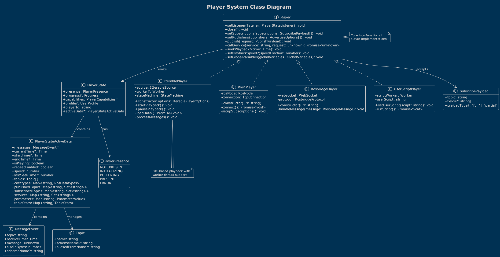
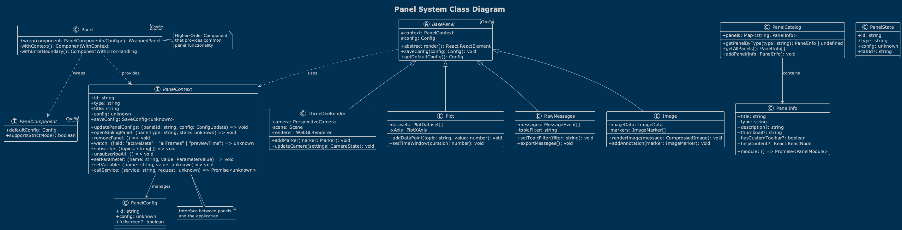
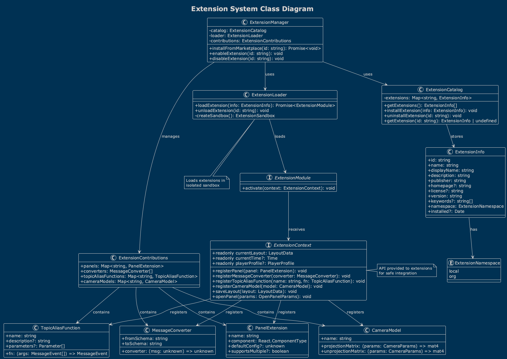
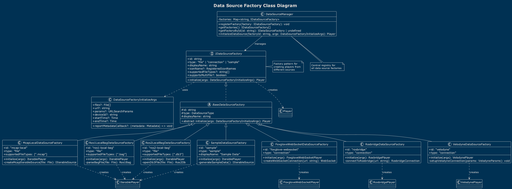
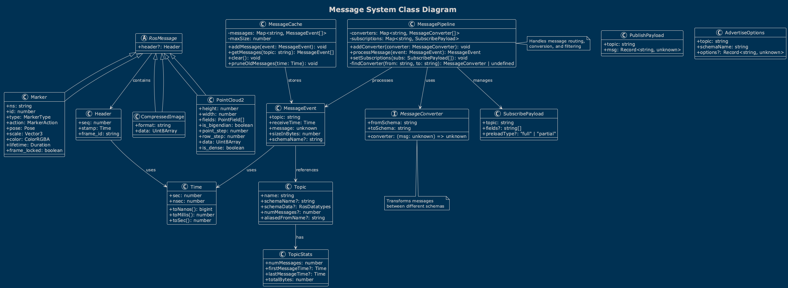
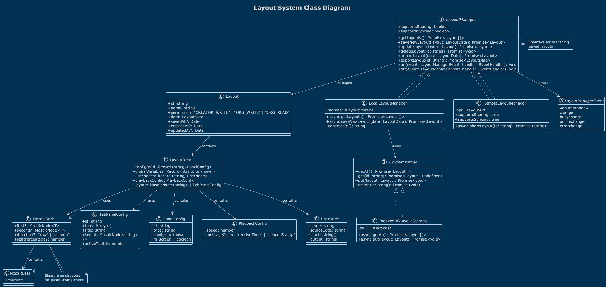

# Lichtblick Class Diagrams

This document provides detailed class diagrams for the core components of the Lichtblick system.

## Table of Contents

1. [Player System](#player-system)
2. [Panel System](#panel-system)
3. [Extension System](#extension-system)
4. [Data Source Factory](#data-source-factory)
5. [Message System](#message-system)
6. [Layout System](#layout-system)

## Player System

The Player system is responsible for managing data playback, real-time connections, and message delivery to panels.

The Player interface defines the contract for all player implementations. Each player type handles a specific data source or protocol:

- **IterablePlayer**: Handles file-based sources with worker support
- **Ros1Player**: Direct ROS1 connections
- **RosbridgePlayer**: WebSocket-based ROS bridge
- **UserScriptPlayer**: Custom user script processing

Key relationships:
- All players implement the `Player` interface
- Players emit `PlayerState` updates to listeners
- Players manage topic subscriptions and publishers

## Panel System

The Panel system provides the UI components for data visualization and interaction.

The panel architecture uses:
- **Higher-Order Component Pattern**: `Panel<Config>` wraps panel components
- **Context Pattern**: `PanelContext` provides panel-specific APIs
- **Registry Pattern**: `PanelCatalog` manages available panels

Panel lifecycle:
1. Panel is registered in the catalog
2. User adds panel to layout
3. Panel receives configuration and context
4. Panel subscribes to topics via context
5. Panel renders messages from player state

## Extension System

The Extension system allows third-party developers to extend Lichtblick functionality.

Extensions can contribute:
- Custom panels
- Message converters
- Topic alias functions
- Camera models

The extension lifecycle:
1. Extension is discovered and loaded
2. Extension registers contributions via context
3. Contributions are added to respective registries
4. UI updates to reflect new capabilities

## Data Source Factory

The Data Source Factory pattern provides a clean abstraction for different data sources.

Each factory:
- Implements `IDataSourceFactory` interface
- Handles specific file types or connection protocols
- Creates appropriate player instances
- Manages initialization parameters

## Message System

The Message system handles data flow from sources to panels.

Key components:
- **MessageEvent**: Core message structure
- **Topic**: Message channel metadata
- **SubscribePayload**: Subscription configuration
- **MessageConverters**: Transform between schemas

Message flow:
1. Source produces messages
2. Player filters by subscriptions
3. Converters transform if needed
4. Panels receive processed messages

## Layout System

The Layout system manages panel arrangements and configurations.

Layout components:
- **LayoutManager**: Manages saved layouts
- **MosaicNode**: Tree structure for panel arrangement
- **TabPanelConfig**: Multi-tab panel containers
- **PanelConfig**: Individual panel settings

Layout features:
- Save/load layouts
- Share layouts
- Import/export
- Permission management

## Implementation Details

### State Management

Lichtblick uses a combination of:
- **React Context**: For dependency injection
- **Zustand**: For global state management
- **Component State**: For local UI state

### Type Safety

The system leverages TypeScript for:
- Interface definitions
- Generic type parameters
- Discriminated unions
- Strict null checking

### Performance Optimizations

- **Worker Threads**: Heavy processing off main thread
- **Lazy Loading**: Panels load on demand
- **Memoization**: Expensive computations cached
- **Virtual Rendering**: Large datasets rendered efficiently

### Extension Points

The architecture provides multiple extension points:
1. Custom panels via extension API
2. Message converters for schema adaptation
3. Topic alias functions for computed topics
4. Camera models for 3D visualization
5. Custom data sources via factory pattern

---

For more information, see:
- [Architecture Overview](architecture-overview.md)
- [Sequence Diagrams](sequence-diagrams.md)
- [API Documentation](api-documentation.md)