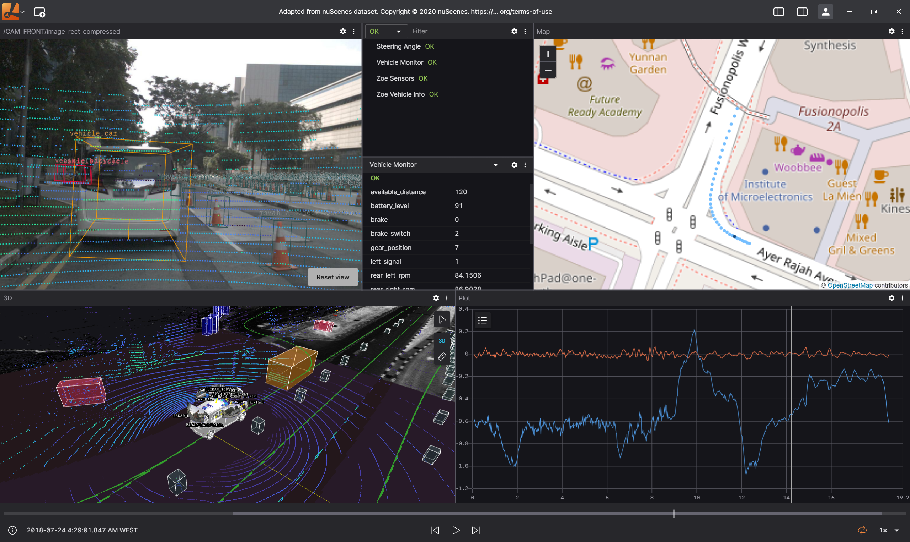

# Lichtblick Documentation

Welcome to the Lichtblick documentation. Lichtblick is an integrated visualization and diagnosis tool for robotics, available in your browser or as a desktop app on Linux, Windows, and macOS.

## Contents

1. [Getting Started](./getting-started.md)
2. [Architecture Overview](./architecture.md)
3. [Features](./features.md)
4. [User Guide](./user-guide.md)
5. [API Documentation](./api/index.md)
   - [Creating Custom Panels](./api/custom-panels.md)
   - [Creating Custom Data Sources](./api/custom-data-sources.md)
6. [Developer Guide](./developer-guide.md)
7. [FAQs](./faq.md)
8. [Common Tasks](./common-tasks.md)
   - [Adding Filters](./adding-filters.md)
   - [Data Loading Sequence](./data-loading-sequence.md)
   - [Add Filter Sequence](./add-filter-sequence.md)

## About Lichtblick

Lichtblick is a powerful tool for robotics visualization and debugging. It supports various data sources including ROS1, ROS2, MCAP files, and more. The application provides a comprehensive set of visualization panels for different types of data, allowing users to analyze and understand complex robotics systems.

