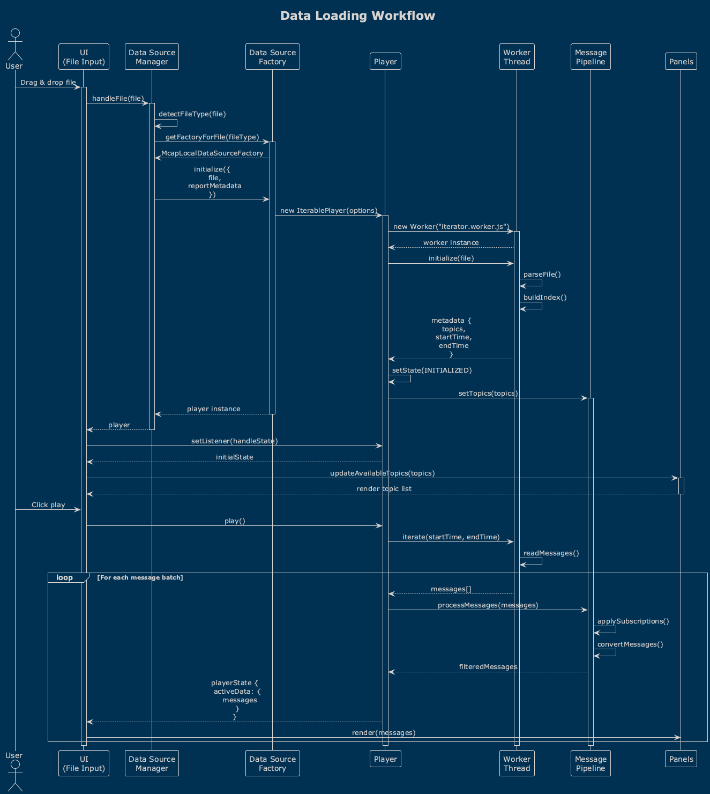
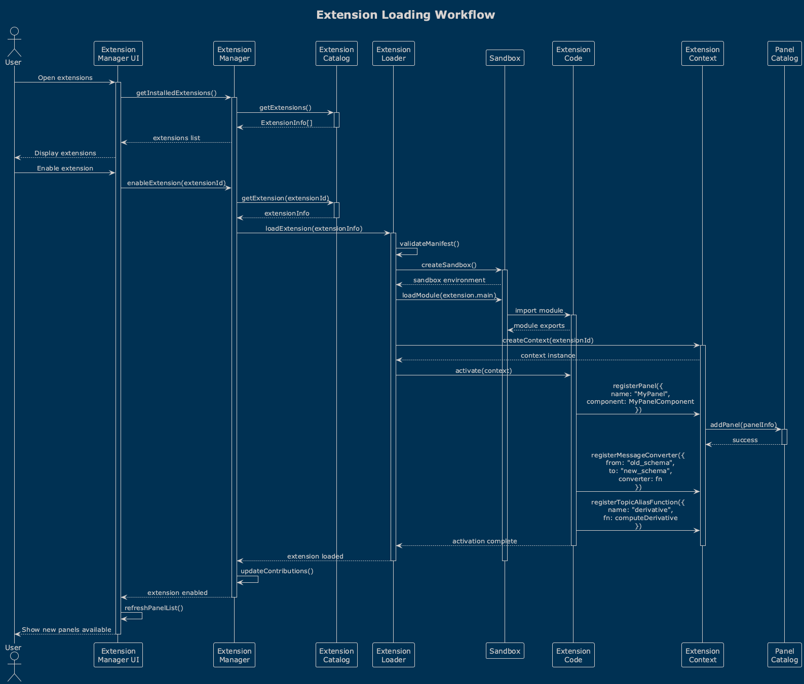
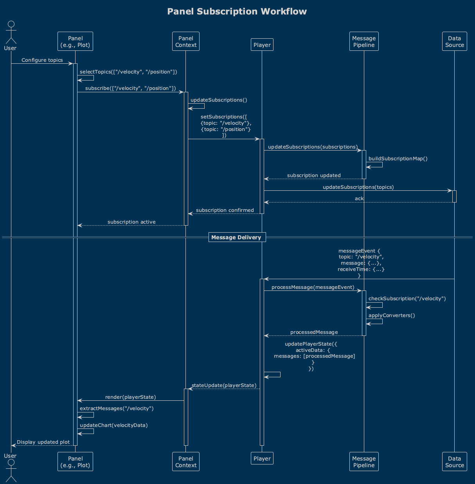
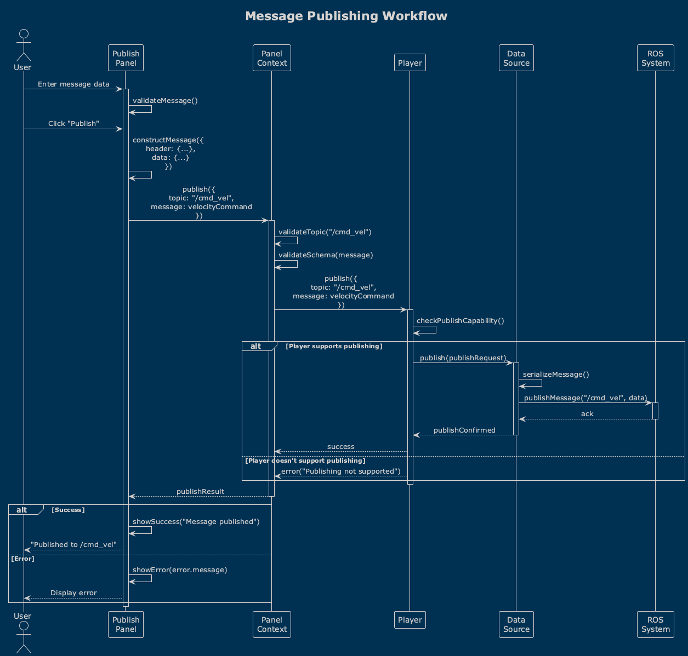
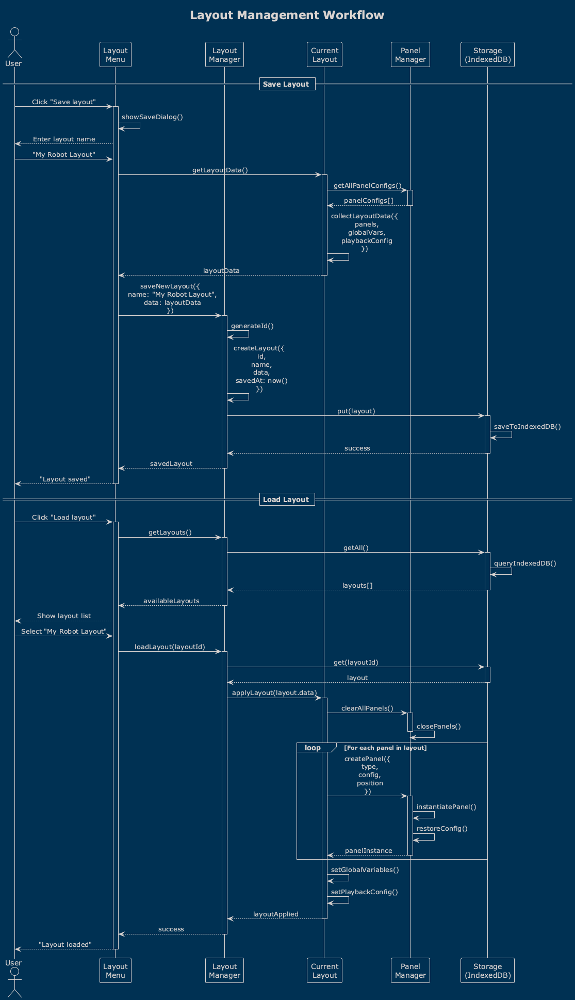
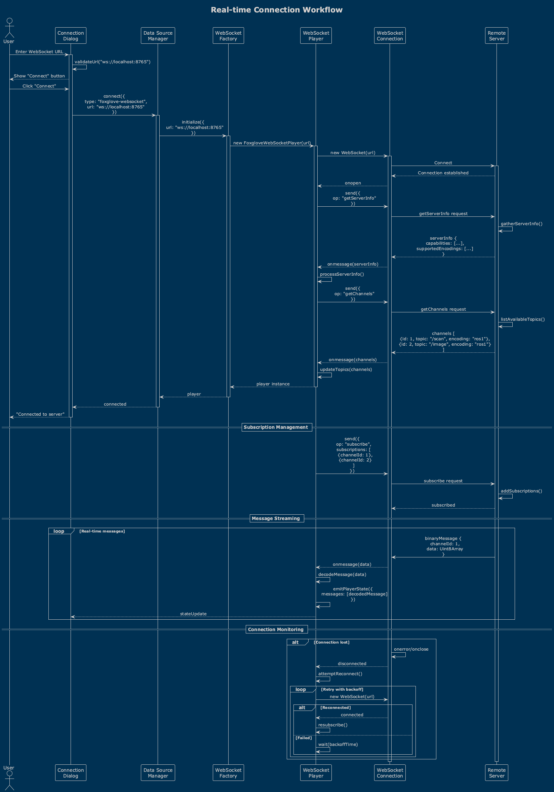

# Lichtblick Sequence Diagrams

This document provides sequence diagrams for the main workflows in the Lichtblick system.

## Table of Contents

1. [Data Loading Workflow](#data-loading-workflow)
2. [Extension Loading](#extension-loading)
3. [Panel Subscription](#panel-subscription)
4. [Message Publishing](#message-publishing)
5. [Layout Management](#layout-management)
6. [Real-time Connection](#real-time-connection)

## Data Loading Workflow

The data loading workflow shows how files are processed and made available for playback.

This workflow involves:
1. User selects a file (drag & drop or file picker)
2. System identifies appropriate data source factory
3. Factory creates player instance
4. Player initializes data source
5. Data is parsed and indexed
6. Player emits state updates
7. UI updates to show available topics

## Extension Loading

The extension loading process shows how third-party extensions are discovered and activated.

Key steps:
1. Extension manager discovers installed extensions
2. Extension manifest is validated
3. Extension code is loaded in sandbox
4. Extension receives context API
5. Extension registers contributions
6. UI updates with new capabilities

## Panel Subscription

This diagram shows how panels subscribe to topics and receive messages.

The subscription process:
1. Panel requests subscription via context
2. Context updates player subscriptions
3. Player filters messages by subscription
4. Messages delivered to panel via state updates
5. Panel renders received data

## Message Publishing

The message publishing workflow shows how panels can publish messages.

Publishing steps:
1. Panel prepares message data
2. Panel calls publish via context
3. Context validates message format
4. Message sent to player
5. Player publishes to data source
6. Confirmation returned to panel

## Layout Management

Layout management handles saving and loading panel arrangements.

Layout operations:
1. User triggers save layout
2. Current layout state collected
3. Layout saved to storage
4. User can load saved layout
5. Panels recreated from layout data
6. State restored for each panel

## Real-time Connection

Real-time connection workflow for WebSocket and ROS connections.

Connection process:
1. User enters connection URL
2. Appropriate player created
3. Connection established
4. Topics discovered
5. Subscriptions managed
6. Real-time messages delivered
7. Connection monitoring and reconnection

## Implementation Notes

### Error Handling

All workflows include error handling:
- Invalid file formats show error dialog
- Connection failures trigger reconnection
- Extension errors are isolated
- Layout corruption handled gracefully

### Performance Considerations

- File loading uses workers for large files
- Message delivery batched for efficiency
- Subscriptions managed to minimize overhead
- Layout operations are debounced

### State Management

- Player state is the source of truth
- Panels receive immutable state updates
- Layout changes trigger controlled re-renders
- Extension state isolated from core

---

For more information, see:
- [Architecture Overview](architecture-overview.md)
- [Class Diagrams](class-diagrams.md)
- [Use Cases](use-cases.md)