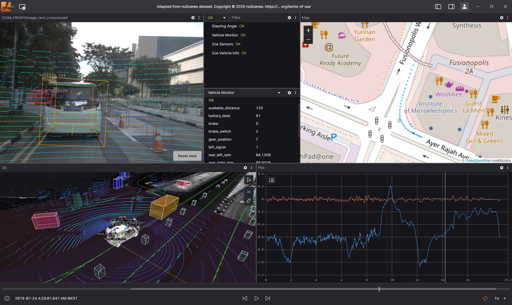

# User Guide

This user guide provides detailed instructions for using Lichtblick's features and capabilities.

## Table of Contents

1. [Application Interface](#application-interface)
2. [Working with Data Sources](#working-with-data-sources)
3. [Working with Layouts](#working-with-layouts)
4. [Using Panels](#using-panels)
5. [Customizing Your Experience](#customizing-your-experience)
6. [Advanced Features](#advanced-features)

## Application Interface

### Main Interface Components

The Lichtblick interface consists of the following key components:

- **Top Bar**: Contains application controls, data source selector, and layout controls
- **Panel Area**: The main workspace where visualization panels are displayed
- **Status Bar**: Displays information about the current data source and playback controls

### Navigation

- Use the top bar to switch between different layouts and data sources
- Use panel headers to move, resize, and configure individual panels
- Use playback controls in the status bar to navigate through recorded data

## Working with Data Sources

### Opening a Data Source

1. Click on the "Open Data Source" button in the top left corner
2. Select the type of data source you want to connect to:
   - Local File (.bag, .mcap, .ulog)
   - ROS1 Socket
   - Rosbridge WebSocket
   - Foxglove WebSocket

### Local Files

1. Select the appropriate file type (ROS1 Bag, ROS2 Bag, MCAP, ULog)
2. Browse to the file location and select the file
3. The file will be loaded and its topics will become available to panels

### Live Connections

#### ROS1 Socket

1. Select "ROS1 Socket" as the data source type
2. Enter the ROS Master URI (e.g., `http://localhost:11311`)
3. Click "Connect" to establish the connection

#### Rosbridge WebSocket

1. Select "Rosbridge WebSocket" as the data source type
2. Enter the WebSocket URL (e.g., `ws://localhost:9090`)
3. Click "Connect" to establish the connection

#### Foxglove WebSocket

1. Select "Foxglove WebSocket" as the data source type
2. Enter the WebSocket URL
3. Click "Connect" to establish the connection

### Working with Playback

For recorded data sources (bag files, MCAP files, etc.), you can control playback using the controls in the status bar:

- **Play/Pause**: Start or stop playback
- **Step Forward/Backward**: Move one message at a time
- **Speed Control**: Adjust playback speed
- **Seek Bar**: Jump to a specific time in the recording

## Working with Layouts

### Creating a Layout

1. Click on the "Layout" button in the top bar
2. Select "Create New Layout"
3. Enter a name for the new layout
4. The new layout will be created and become active

### Adding Panels

1. Click the "Add Panel" button (+ icon) in the top right corner
2. Select a panel type from the list
3. The panel will be added to your layout

### Panel Arrangement

- **Move**: Drag a panel by its header to move it
- **Resize**: Drag the edges or corners of a panel to resize it
- **Split**: Drag a panel to the edge of another panel to create a split view
- **Maximize**: Double-click a panel header to maximize it
- **Close**: Click the X button on a panel header to remove it

### Saving Layouts

1. Click on the "Layout" button in the top bar
2. Select "Save Layout" to update the current layout
3. Select "Save Layout As..." to create a copy with a new name

### Managing Layouts

1. Click on the "Layout" button in the top bar
2. Select "Layout Manager" to see all available layouts
3. From here you can:
   - Switch between layouts
   - Delete layouts
   - Export layouts to share with others
   - Import layouts from files

## Using Panels

### Common Panel Controls

Most panels have the following controls:

- **Settings**: Click the gear icon to open panel settings
- **Help**: Click the question mark icon for panel-specific help
- **Menu**: Click the three dots for additional options

### 3D Panel

The 3D Panel visualizes 3D data such as point clouds, meshes, and coordinate frames.

1. **Adding a 3D Object**:
   - Open the panel settings
   - Select the "Topics" tab
   - Choose topics to visualize (e.g., point clouds, transforms)

2. **Navigation**:
   - Left click + drag: Rotate the view
   - Right click + drag: Pan the view
   - Scroll wheel: Zoom in/out
   - Click on an object to select it

3. **Display Options**:
   - Grid: Toggle and configure the reference grid
   - Axes: Show/hide and configure coordinate axes
   - Background: Change background color

### Plot Panel

The Plot Panel visualizes numerical data as line charts, scatter plots, etc.

1. **Adding Data**:
   - Open the panel settings
   - Select the "Topics" tab
   - Choose topics and fields to plot

2. **Plot Controls**:
   - Click and drag to pan
   - Scroll to zoom
   - Double-click to reset view
   - Click on the legend to toggle series visibility

3. **Display Options**:
   - Plot Type: Line, scatter, etc.
   - Y-Axis: Auto-scale, manual range, etc.
   - Series Colors: Customize the color of each series

### Image Panel

The Image Panel displays image data from camera topics.

1. **Selecting an Image Source**:
   - Open the panel settings
   - Select an image topic

2. **Display Controls**:
   - Zoom: Scroll wheel or pinch gesture
   - Pan: Click and drag
   - Reset: Double-click

3. **Display Options**:
   - Encoding: Change color encoding
   - Transformations: Rotate, flip
   - Overlays: Add calibration or other overlays

### Raw Messages Panel

The Raw Messages Panel displays the raw data for selected topics.

1. **Selecting Topics**:
   - Open the panel settings
   - Select topics to display

2. **Viewing Messages**:
   - Messages are displayed in a structured JSON format
   - Expand/collapse objects using the arrow icons
   - Search within messages using the search bar

### Map Panel

The Map Panel visualizes 2D maps, paths, and robot positions.

1. **Selecting Map Data**:
   - Open the panel settings
   - Select a map topic (typically `/map` or `/occupancy_grid`)
   - Add robot pose, path, and other topics as needed

2. **Navigation**:
   - Pan: Click and drag
   - Zoom: Scroll wheel
   - Reset: Double-click

### Other Panels

Each panel has its own specific features and settings. Use the help icon in each panel for panel-specific instructions.

## Customizing Your Experience

### Application Settings

1. Click on the gear icon in the top right corner
2. Adjust settings like:
   - Theme (Dark/Light)
   - Time display format
   - Performance settings
   - Language

### Panel Settings

Each panel type has its own settings. Generally:

1. Click on the gear icon in the panel header
2. Adjust settings specific to that panel type
3. Settings are automatically saved with your layout

## Advanced Features

### Global Variables

Global variables can be used across panels:

1. Click on the "Variables" button in the top bar
2. Create a new variable with a name and value
3. Use the variable in panels that support it

### User Scripts

The User Script Editor allows you to write custom JavaScript/TypeScript:

1. Add a User Script panel
2. Write your script using the editor
3. Scripts can subscribe to topics and publish new derived data

### Adding Custom Extensions

1. Click on the gear icon in the top right corner
2. Select "Extensions"
3. Click "Install Extension" and select an extension file
4. Follow the extension-specific instructions

For more detailed information on specific features, please refer to the appropriate section of the documentation.
